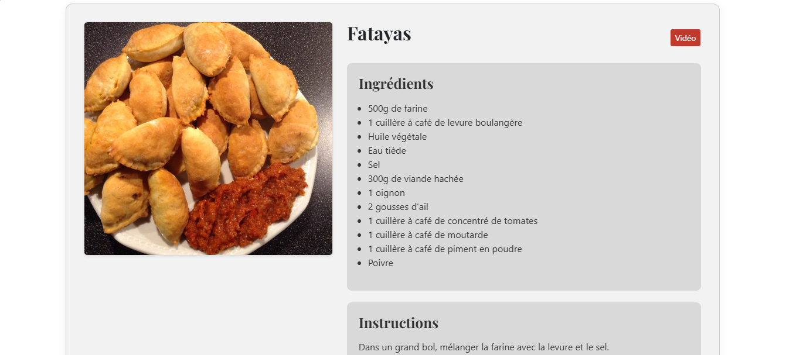
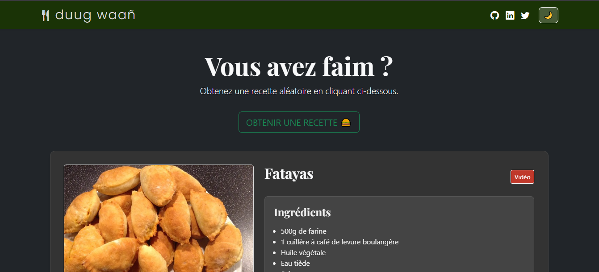

# 🍲 duug waañ | générateur de recettes sénégalaises

**Duug Waañ** ("Entrer dans la cuisine" en wolof) est un générateur de recettes sénégalaises interactif. Ce projet a été conçu pour célébrer le patrimoine culinaire du Sénégal tout en offrant une expérience utilisateur moderne, fluide et accessible (light/dark mode).




## 🚀 Fonctionnalités

- **Génération aléatoire :** Obtenez une idée de plat, d'en-cas ou de dessert en un clic.
- **Fiches complètes :** Affichage du nom, des ingrédients, des instructions détaillées et d'un visuel du plat.
- **Contenu multimédia :** Accès direct à des tutoriels vidéo YouTube pour chaque recette.
- **Mode sombre :** Une interface adaptative pour un confort de lecture optimal.
- **Design responsive :** Entièrement compatible avec les tablettes et mobiles grâce à Bootstrap 5.

## 🛠️ Stack Technique

- **Frontend :** HTML5, CSS3, JavaScript (ES6+).
- **Framework CSS :** Bootstrap 5.
- **Données :** Fichier JSON structuré pour une gestion dynamique du contenu.
- **UI/UX:** Figma (pour le wireframe).

## 📂 Structure du projet

```text
├── index.html          # Structure principale de l'application
├── styles.css          # Design personnalisé et gestion du mode sombre
├── script.js           # Logique de récupération JSON et manipulation du DOM
├── recettes.json       # Base de données des recettes
└── assets/             # Logos, icônes et images des plats
```

## 📖 Installation et utilisation

- Clôner le dépôt :

  ```bash
    git clone https://github.com/metzoo10/duug-waan.git
  ```

- Lancement :

  Comme le projet utilise l'API fetch() pour charger le fichier JSON, il est recommandé d'utiliser un serveur local (ex: extension Live Server sur VS Code ou un serveur Python simple).

  ```bash
    # Exemple avec Python
    python -m http.server 8000
  ```

- Ouvrez votre navigateur à l'adresse http://localhost:8000.
